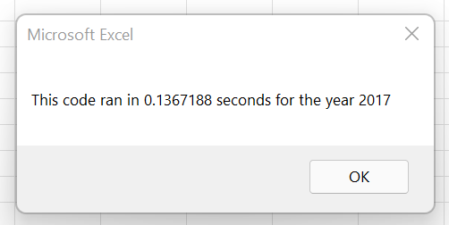
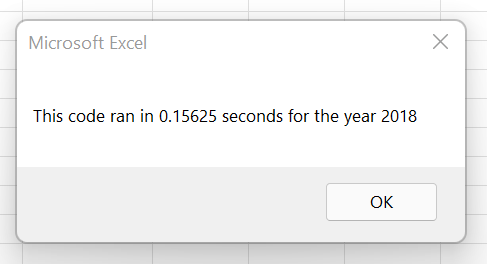
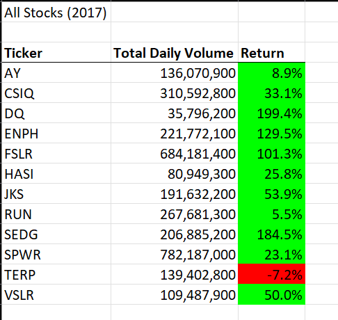
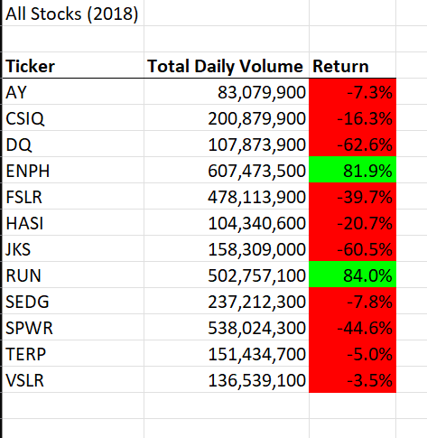

# **Analyzing Stock Performance Using VBA**

## **Overview**
### Background
To ensure that investments are made using sound judgement, the yearly stock performance can be analyzed including fields such as daily traded shares and difference in closing prices.  This can become overwhelming given how many data points are obtained. In this analysis, VBA is used to quickly iterate through the data, and calculate the total volume of traded shares and the return percentage in closing price from the start to the end of years for 12 tickers. 

### Objective
Inherited partial code underwent refactoring to run faster for the user. By modifying the code to loop through the data once instead of 12 times, the user can begin analysis on the stock data quicker. Data for years 2017 and 2018 were supplied for analysis. 


## **Results**


### VBA Analysis
To eliminate the need for embedded for loops, a ticker index variable and four arrays for (1)tickers, (2)volumes, (3)starting prices, and (4)ending prices were introduced. The for loop incrementally looped through the spreadsheet's rows, while strategic If/Else statements compared the current row's ticker information in Column A to the ticker array using the ticker index and stored information in the appropriate arrays. 

#### _Volumes, Start Price, End Price Calculations_
The script utilized the ticker index and summed the row's volume in the tickerVolumes array. 

```
tickerVolumes(tickerIndex) = tickerVolumes(tickerIndex) + Cells(i, 8).Value
```

It also used the ticker index to test the ticker array to the previous and next row's ticker in Column A to identify the respective open and closing price for the ticker. Those values are stored in the tickerEndingPrices and tickerStaringPrices arrays.

```
If Cells(i - 1, 1).Value <> tickers(tickerIndex) Then
	tickerStartingPrices(tickerIndex) = Cells(i, 6).Value
End If

If Cells(i + 1, 1).Value <> tickers(tickerIndex) Then
	tickerEndingPrices(tickerIndex) = Cells(i, 6).Value
End If
```


At the end of the row, the program performed a check to see if the next row contained the same ticker or if the ticker index needed to be increased.

```
If Cells(i + 1, 1).Value <> tickers(tickerIndex) Then
  tickerIndex = tickerIndex + 1
End If
```

[The code can be found here.](./Resources/Refactored_Stock_Analysis_Code.txt) 


#### _Run Time_
By eliminating the need for multiple loops over the data, the macro ran efficiently, and decreased runtime from 10 seconds to less than .1 second. Below are run times for both the 2017 and 2018 data with the refactored code. Also for the user's conmvenience, an interactive prompt will ask for the desired year and buttons are available to run and clear the code. The old code is still on display for comparison. 





 
### Stock Analysis
The only stock that performed well in 2017 and 2018 was ENPH, which returned 129.5% and 81.9% respectively. RUN also posted positives in both years, with 2018 much more impressive than 2017.  Since majority of the stocks were negative returns in 2018, it is worthwhile to investigate why these two companies were profitable. Two more companies to look into are SEGD and VSLR, since they ended 2017 with notable returns, and were not as impacted by 2018's downturn.




### **Summary**


### Refactoring
Refactoring code can be extremely beneficial in improving speed or functionality. Taking a script that already has good structure or calculations can decrease the amount of time of the project compared to starting from scratch.  The downfall is that a script contains the coder's voice, and it can be a challenge to make edits to someone else's code. The first step is to understand what has been inherited, and then tweaking it to fulfill the project's needs. Also, looking at code can create a paradigm that could be difficult to shift away from when refactoring the code. While running efficiently is important, a cost-benefit analysis on time spent refactoring compared to improvement in runtime should be considered.

### All Stocks Analysis Macro 
In the case of the All Stocks Analysis Macros, the code contained most of the formatting requirements which is, subjectively, the most time-consuming portion of coding in VBA. It allowed for more time to be spent on the logic portion of the code. The biggest challenge was to find another logical way to loop through the data instead of the embedded for loops. 
